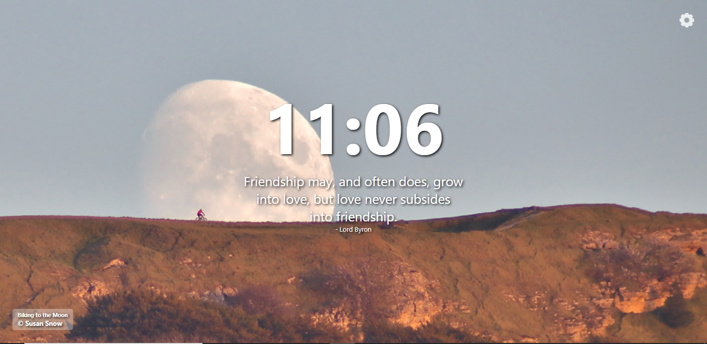

# Astrominia-Chrome-Extension
Beautiful Images from NASA and Quotes on Every New Tab You Open.

## Live Preview
See How the Extension will work on Opening a New Tab, witjout actually installing remotely on your browser. (Click Here.](https://astrominia.netlify.app/)

## Screenshot Preview

## APIs used
1) [NASA APoD](https://api.nasa.gov/)

   Sends a new Image everyday.

2) [Quotable](https://api.quotable.io/)

   Gives a Wisdom.

## License
[MIT](https://choosealicense.com/licenses/mit/)
